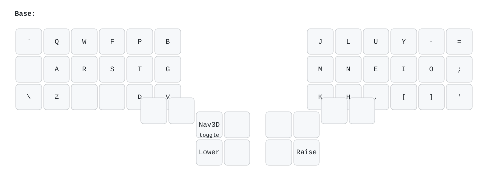
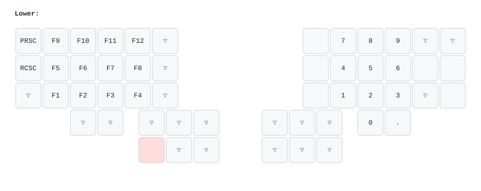
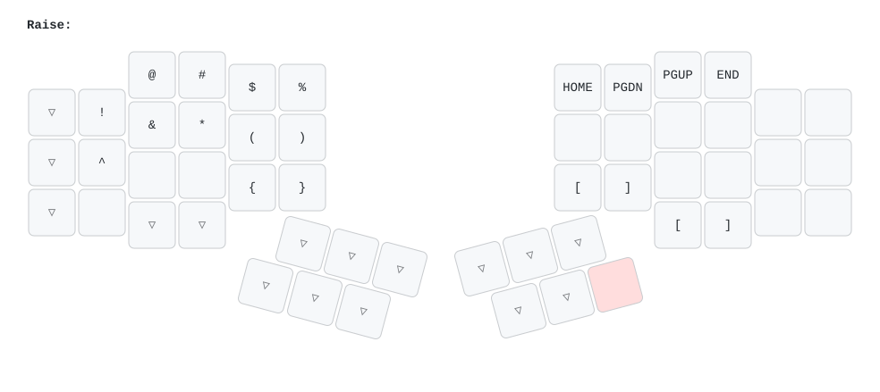
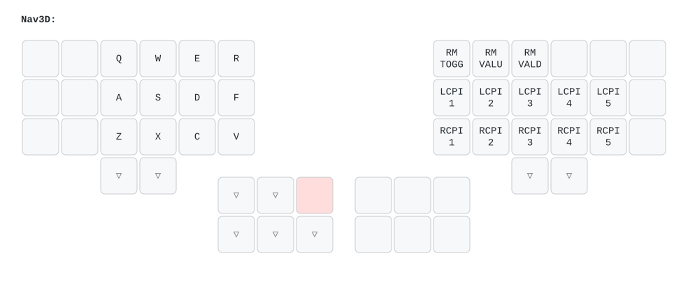

# QMK Imprint Layout

(for the same functionality on ZMK, see [here](https://github.com/jelmansouri/kyria-zmk))

Layout iteration is deceptively punishing: you only notice real flaws after you've practiced enough to be fast, and by then you've built muscle memory you might need to unlearn. The reason this is workable, beside the fun of learning is the ergo keyboard community being generous with their notes and over time you start building instincts for what will or won't work.

My layout primary goals
 * Make HRM feel snappy and predictable without timing games.
 * Preserve all capabilities of a normal keyboard, and improving on many aspects (numpad layer, ...).
 * Reduce cognitive load of having to do more things to access capabilities (low number of layers, ...).
 * Provide good ergonomics and quality of life for my day to day usage (Coding, debugging, writing).
 * Optimize for MacOS
 
## Shiftless and timeless homerow mods

One of the most common recommendations in the ergo keyboard world is to adopt **home row mods (HRMs)**. I first tried them through Oryx on a fresh Voyager, back before **chordal hold** was available in QMK. I didn't want to give up Oryx to use Accordion at the time, so I experimented with **tap-hold terms** and every available setting. Eventually I gave up: the setup **hurt more than it helped**. I felt **latency on the home row**, dealt with **too many false positives and negatives**, and the experience killed my enjoyment of the board. Tap-hold on the **thumb cluster** (Enter and Space) felt like the **lesser evil**, since latency bothered me less there.

When I switched to the **Corne**, the extra thumb key helped me push more modifiers down to the thumbs. It was an improvement, but still imperfect:  
- **Mod-taps overlapped with Enter and Space**, often triggering the wrong thing (like sending a message prematurely).  
- **Combining multiple modifiers required awkward finger gymnastics**, which felt especially out of place on an ergo board.

A major motivation for moving to the **Kyria** (besides its better stagger, which is hard to give up once you get used to it) was the **extra thumb keys**. I dedicated the **innermost cluster** (aligned vertically) to modifiers:  
- Shift + Ctrl on one side  
- Cmd + Shift on the other  

This worked better, but **combining multiple modifiers was still clumsy**, especially when layers were involved (e.g., **Option + Shift + nav layer + arrows to select text**).
Around that time I saw a write-up about the **Kyriel design**, which implements home row mods **without relying on mod-tap behavior**. I gave it a fair **two-week trial** while on vacation. It introduced more layers so modifiers could sit on the same side as the layer thumb keys, which gave the layout a **clean internal logic** I really enjoyed. But even with consistent use, **it never felt comfortable enough**. That's when I decided to give tap-hold another shot--this time with **urob's "timeless" HRM approach**. It directly solved one of my biggest gripes:  
- **Perceived latency**  
- **Reliance on tapping term** (since my typing speed isn't consistent)  

With **flow tap** (`require-prior-idle` on ZMK), false positives dropped to **nearly zero**, and the layout finally felt **snappy**. The only remaining issue was **false negatives--mostly with Shift**. Typing something like `AsRef` required waiting for the `FLOW_TAP_TERM` before hitting `R`, which was frustrating.

**Solution:** I moved **Shift back to a dedicated thumb key** on both halves, and left only **GUI, Alt, and Ctrl** on the home row.  

As a **Mac and Vim user**, I use all three often--far more than on Windows where Ctrl dominates shortcuts--so keeping the **natural Ctrl-Opt-Cmd order** from Mac keyboards made sense.  
I didn't have to sacrifice one of them to the pinky, and the layout became both **consistent and reliable**.

The unavoidable challenge with HRM is that it cares about **release order as well as press order**. 

My muscle memory only tracked presses. For example:  
- `Ctrl + A` could be done as:  
  - `Ctrl down -> A down -> Ctrl up -> A up` ✅ (works)  
  - `Ctrl down -> A down -> A up -> Ctrl up` ❌ (fails with timeless HRM + permissive hold/balanced)  

Rewiring this took practice. I spent **10 minutes a day drilling the correct up/down order**, and after about **two weeks** I saw a real improvement.

### Configuration

I'm using the following configuration to achieve timeless homerow mods in QMK:

```c
#define TAPPING_TERM 280
#define FLOW_TAP_TERM 150
#define CHORDAL_HOLD
#define PERMISSIVE_HOLD
#define QUICK_TAP_TERM 0
#define CAPS_WORD_INVERT_ON_SHIFT
```

In addition to QMK's default behavior defined by the configuration above, I've added a custom rule for bilateral holds. Once a hold is detected on one hand, any simultaneous holds on the other hand are treated as tap-holds rather than modifier holds. In practice, this means you can't activate the same modifier on both sides at once. For example, depending on which hand is holding Control, you'll end up with either Ctrl + I repeating or Ctrl + R repeating, but never Control being held on both hands simultaneously.

## Layers:

After wrestling with home-row mods, the next big design decision was how many layers to live with. Putting Shift on the thumb cluster broke the neat modifier-layer logic I had liked in the Kyriel approach, but it wasn't much of a concession. I prefer a low number of layers anyway--constant layer switching only adds to the cognitive burden while typing. What mattered more was keeping navigation and the numpad anchored on the right half of the split. I'm used to moving lines in code editors by typing a relative line number followed by up or down, so I needed a flow where my left hand triggers the layer, the right hand types the number, and then I can immediately switch to Raise (sometimes while still holding Lower) and hit the direction keys. That interaction dictated the way I built the layers more than anything else.



- **Layout**: Colemak-DH, with small punctuation tweaks.  
  - Underscore and colon moved to be more accessible to the pinky (frequently used in code).  

- **Thumb cluster**:  
  - Outer thumb key = reserved for rarely used functions (least accessible position).  

- **Tap-hold toggle**:  
  - Special key to **disable tap-hold** when needed.  
  - Used mainly for **long-press vowels** on macOS, which brings up accented characters (essential for writing in French).  
  - Technically implemented as a layer, but functionally just a "tap-hold off" switch.  

- **Dedicated Command key**:  
  - Placed on the right side.  
  - Allows triggering shortcuts easily while the left hand is on the mouse.
 


- **Left side (function row)**:  
  - Arranged as 4 function keys per line.  
  - F10-F12 placed at the top for quick access (commonly used for debugging in Visual Studio).  

- **Right side (numpad)**:  
  - Standard numpad layout, with 0 next to the one, found that messing with thr order to privillege moat used used numbers not worth it.
  - Issue: `3` key overlaps with the dot on base, forcing an extra layer switch when ryping float, tryed added a dot on the thumb cluster beneath it but two dots keys became confusing, so reverted.  



- **Left side (symbols)**:  
  - Symbols arranged in the same order as a standard US keyboard.  
  - This side is **never combined with modifiers**, to avoid conflicts with tap-hold logic on the right side. Option-* is Option-Shift-4 which is accessible on the lower layer.

- **Right side (navigation + brackets)**:  
  - Arrow keys laid out in Vim order (H, J, K, L).  
  - Shifted one column to the right so they fall under stronger fingers.  
  - Brackets placed here as well, since they are often used in combination with modifiers.



Finally, I keep a dedicated layer for 3D navigation. My day-to-day work involves sometimes testing stuff i develop in 3D editors, and most of those tools cluster navigation shortcuts on the left side, assuming the right hand is busy on the mouse. I mirrored that expectation: this layer uses a conventional layout that matches the defaults in most software, so I never have to remap anything. Switching into it feels natural, and it keeps my muscle memory aligned across all the different 3D packages I touch.

