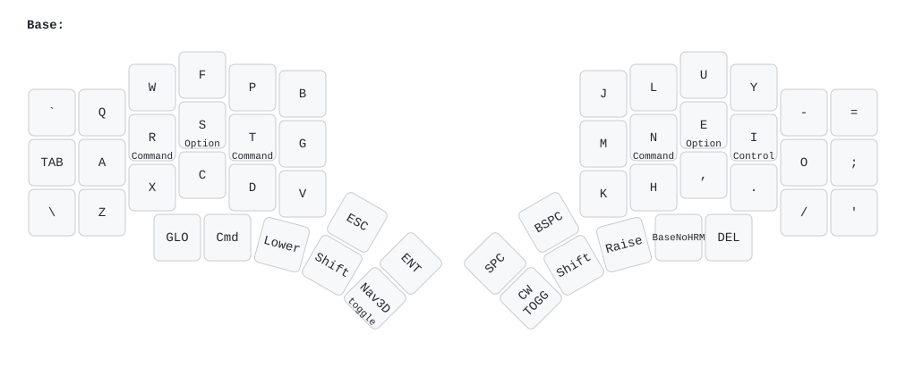
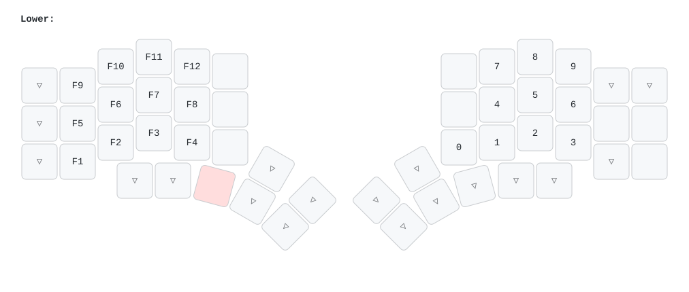
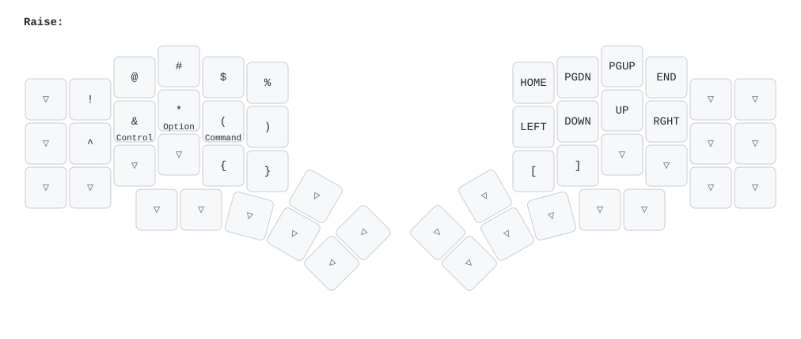
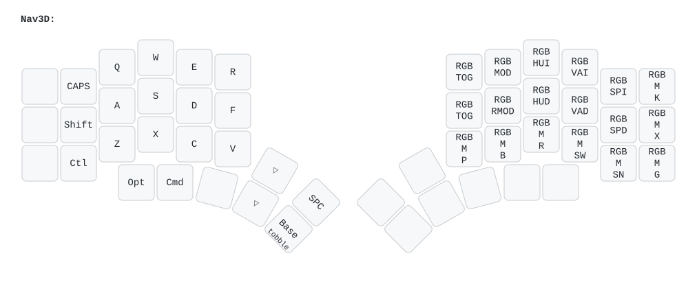

# QMK Kyria Layout

(for the same functionality on ZMK, see [here](https://github.com/jelmansouri/kyria-zmk))

Layout iteration is deceptively punishing: you only notice real flaws after you’ve practiced enough to be fast, and by then you’ve built muscle memory you might need to unlearn. The only reason this is workable is the ergo keyboard community being generous with their notes and over time you start building instincts for what will or won’t work.

My layout primary goals
 * Make HRM feel snappy and predictable without timing games.
 * Preserve all capabilities of a normal keyboard, and improving on many aspects (num layer pad, ...).
 * Reduce cognitive load of having to do more things to access capabilities (low number of layers, ...).
 * Provide good ergonomics ans quality of life for my day to day usage (Coding, debugging, writing).
 * Enjoy typing.
 
## Shiftless and timeless homerow mods

One of the most common recommendations in the ergo keyboard world is to adopt homerow mods. I first tried them through Oryx on a fresh Voyager, back before chordal hold was available in QMK. I didn’t want to give up Oryx to use Accordion at the time, so I experimented with tap-hold terms and every available setting. Eventually I gave up: the setup hurt more than it helped. I felt latency on the homerow, dealt with too many false positives and negatives, and the experience killed my enjoyment of the board. Tap-hold on the thumb cluster (where I had Enter and Space) felt like the lesser evil, since latency bothered me less there.

When I switched to the Corne, the extra thumb key helped me push more modifiers down to the thumbs. It was an improvement, but still imperfect—mod-taps overlapped with Enter and Space, and half the time I’d trigger the wrong thing (like sending the message by hitting Enter instrpeand ir selecting the last word in a chat). Combining multiple modifiers also required awkward finger gymnastics, which felt especially out of place on an ergo board.

A major motivation for moving to the **Kyria** (besides its better stagger, which is hard to give up once you get used to it) was the extra thumb keys. I dedicated the innermost cluster (aligned vertically) to modifiers: Shift + Ctrl on one side, Cmd + Shift on the other. This worked better, but combining multiple modifiers was still clumsy, especially when layers were involved (for example, Option + Shift + nav layer + arrows to select text).

Around that time I saw a write-up about the **[Kyriel](https://github.com/KaiFireborn/kyriel)** design, which implements home-row mods without relying on mod-tap behavior. I gave it a fair two-week trial while on vacation. It introduced more layers so modifiers could sit on the same side as the layer thumb keys, which gave the layout a clean internal logic I really enjoyed. But even with consistent use, it never felt comfortable enough.

That’s when I decided to give tap-hold another shot, this time with **[urob’s “timeless” HRM approach](https://github.com/urob/zmk-config?tab=readme-ov-file#timeless-homerow-mods)**, which I’d seen praised in the community. It directly solved one of my biggest gripe: perceived latency. With flow tap (require-prior-idle on ZMK), false positives dropped to nearly zero, and the layout finally felt snappy. The only remaining issue was false negatives—mostly with Shift. Typing something like AsRef requires you to consciously wait for the flow-tap term/idle before hitting R, which slowed me down. To fix this, I moved Shift back to a dedicated thumb key on both halves, and left only GUI, Alt, and Ctrl on the home row. As a Mac and Vim user, I actually use all three often—far more than on Windows, where Ctrl dominates shortcuts—so keeping the natural Ctrl–Opt–Cmd order from Mac keyboards made sense. I didn’t have to sacrifice one of them to the pinky, and the layout became both consistent and reliable.

The unavoidable challenge with HRM is that it cares about release order as well as press order. My muscle memory only ever tracked presses. For example, Ctrl + A could be done as Ctrl down → A down → Ctrl up → A up, or Ctrl down → A down → A up → Ctrl up. With timeless HRM and permissibve hold/balanced settings, only the first produces the intended behavior. Rewiring this took practice: I spent 10 minutes a day slowly drilling the correct up/down order, and after about two weeks I saw a real improvement.

## Layers:

After wrestling with home-row mods, the next big design decision was how many layers to live with. Putting Shift on the thumb cluster broke the neat modifier-layer logic I had liked in the Kyriel approach, but it wasn’t much of a concession. I prefer a low number of layers anyway—constant layer switching only adds to the cognitive burden while typing. What mattered more was keeping navigation and the numpad anchored on the right half of the split. I’m used to moving lines in code editors by typing a relative line number followed by up or down, so I needed a flow where my left hand triggers the layer, the right hand types the number, and then I can immediately switch to Raise (sometimes while still holding Lower) and hit the direction keys. That interaction dictated the way I built the layers more than anything else.




My base layer is Colemak-DH, with small punctuation tweaks to suit my habits. Underscore and colon are more accessible to the pinky, since I reach for them constantly in code. The outer thumb key is the least reachable spot, so I reserve it for rarely used functions. I also keep a toggle to disable tap-hold keys, which I use whenever I want long-press behavior on vowels. On macOS, that brings up accented characters—a must when I’m writing in French. Technically it’s implemented as a layer, but I think of it less as a layer and more as a “tap-hold off” switch. On the right side I keep a dedicated Command key, so I can trigger shortcuts while my left hand is on the mouse.



The Lower layer is split in personality. On the left, it’s my function row: four per line, with F10–F12 right at the top since those matter most when debugging in Visual Studio. On the right, it becomes a numpad. That’s where I ran into a small annoyance: the 3 key overlaps with the dot on base, forcing an extra switch. I tried adding a dot on the thumb cluster beneath it, but two dots keys just confused me more. It’s a trade-off I still live with.



The Raise layer also divides neatly. On the left, I keep symbols laid out exactly like a US keyboard. I never combine this side with modifiers which matters because I rely on the right side arrow button during long presses and don’t want them tangled with tap-hold logic. The arrow keys on the right are laid out in Vim order but shifted one column to the right. That shift makes them land under my stronger fingers. Brakeds which I use in combination with modifiers is on this side as well.



Finally, I keep a dedicated layer for 3D navigation. My day-to-day work involves sometimes testing stuff i develop in 3D editors, and most of those tools cluster navigation shortcuts on the left side, assuming the right hand is busy on the mouse. I mirrored that expectation: this layer uses a conventional layout that matches the defaults in most software, so I never have to remap anything. Switching into it feels natural, and it keeps my muscle memory aligned across all the different 3D packages I touch.

## Splitkb QMK Userspace

This is the splitkb userspace repository which allows for an external set of QMK keymaps with halcyon modules to be defined and compiled. This is useful for users who want to maintain their own keymaps without having to fork the splitkb QMK or vial repository.

If you want to compile firmware without any modules you can also use the [main qmk_userspace repo](https://github.com/qmk/qmk_userspace).

If the keyboard has not been merged yet to the main branch of QMK you may need to edit the workflow, for that see [Extra info](#extra-info)

### Howto configure your build targets

1. Run the normal `qmk setup` procedure if you haven't already done so -- see [QMK Docs](https://docs.qmk.fm/#/newbs) for details.
1. Fork this repository
1. If you have already forked the `qmk/qmk_userspace` repository before you can add this repository manually following the [steps below](#adding-splitkb-fork-to-an-existing-fork).
1. Clone your fork to your local machine
1. Enable userspace in QMK config using `qmk config user.overlay_dir="$(realpath qmk_userspace)"`
1. Add a new keymap for your board by copy, pasting and renaming the `default_hlc` keymap within the `keyboards/splitkb/halcyon/$KB$/keymaps` folder.
1. You may want to replace the `qmk.json` with the empty `qmk_empty.json` if you want to start from scratch as it will otherwise compile all default options.
1. Add your keymap(s) to the build by running `qmk userspace-add -kb <your_keyboard> -km <your_keymap> -e <halcyon_module>=1 -e TARGET=<filename>`.
    * This will automatically update your `qmk.json` file
    * Corresponding `qmk userspace-remove -kb <your_keyboard> -km <your_keymap> -e <halcyon_module>=1 -e TARGET=<filename>`.
    * Listing the build targets can be done with with `qmk userspace-list`
    * If you want to use a module:
        * For the filename make it so you can differentiate between the different firmwares for the modules. `kyria_rev4_default_encoder` for example.
        * The following options are available for the halcyon modules:
            * HLC_NONE, If you don't have a module installed but you do have a module on the other half.
            * HLC_ENCODER, If you have an encoder module installed.
            * HLC_TFT_DISPLAY, If you have a tft rgb display installed.
            * HLC_CIRQUE_TRACKPAD, If you have a Cirque trackpad installed.
1. Commit your changes


### Howto build with GitHub

1. In the GitHub Actions tab, enable workflows
1. Push your changes above to your forked GitHub repository
1. Look at the GitHub Actions for a new actions run
1. Wait for the actions run to complete
1. Inspect the Releases tab on your repository for the latest firmware build


### Howto build locally

1. Run the normal `qmk setup` procedure if you haven't already done so -- see [QMK Docs](https://docs.qmk.fm/#/newbs) for details.
1. Fork this repository
1. Clone your fork to your local machine
1. `cd` into this repository's clone directory
1. Set global userspace path: `qmk config user.overlay_dir="$(realpath .)"` -- you MUST be located in the cloned userspace location for this to work correctly
    * This will be automatically detected if you've `cd`ed into your userspace repository, but the above makes your userspace available regardless of your shell location.
1. Compile normally: `qmk compile -kb your_keyboard -km your_keymap -e <your_module>=1 -e TARGET=<filename>` or `make your_keyboard:your_keymap -e <your_module>=1 -e TARGET=<filename>`

Alternatively, if you configured your build targets above, you can use `qmk userspace-compile` to build all of your userspace targets at once.


### Extra info

If you wish to point GitHub actions to a different repository, a different branch, or even a different keymap name, you can modify `.github/workflows/build_binaries.yml` to suit your needs.

To override the `build` job, you can change the following parameters to use a different QMK repository or branch, this can be useful if you want to use a the main QMK repository or a different vial branch. For example:
```
    with:
      qmk_repo: qmk/qmk_firmware
      qmk_ref: master
```
Our halcyon module code should work fine with the main QMK repository but it may break if there are any breaking changes from QMK in the future. We will try our best to keep this repository up-to-date.

If you wish to manually manage `qmk_firmware` using git within the userspace repository, you can add `qmk_firmware` as a submodule in the userspace directory instead. GitHub Actions will automatically use the submodule at the pinned revision if it exists, otherwise it will use the default latest revision of `qmk_firmware` from the main repository. This will not work when using vial.

This can also be used to control which fork is used.

1. (First time only) `git submodule add https://github.com/qmk/qmk_firmware.git`
1. (To update) `git submodule update --init --recursive`
1. Commit your changes to your userspace repository


### Adding splitkb fork to an existing fork

#### New branch

If you have already forked the qmk/qmk_userspace repository before you may need to manually add the `halcyon` branch.

1. Add a new upstream `git remote add upstream https://github.com/splitkb/qmk_userspace.git`
1. Fetch the upstream `git fetch upstream`
1. Create a new branch based on the upstream `git checkout -b halcyon upstream/halcyon`
1. Make any changes you want and push it to github `git push -u origin halcyon`

#### Existing branch

You may also want to just add the files to your own branch if you have already setup a custom userspace before.

1. Clone or download the files from our fork or add it as a new branch as above.
1. Copy over the contents of `users/halcyon_modules/rules.mk` and the `users/halcyon_modules/splitkb/` folder to your personal user folder.

If you want to modify an existing keymap (from the original Kyria, Elora or an Aurora board for example). Make sure to add 10 new keys in your keymap (Look at `keyboards/splitkb/halcyon/kyria/keymaps/default_hlc` for an example).

Do note that we use some quantum functions in our userspace so there may be a conflict when compiling. If you use the `_user` functions you should be fine.
