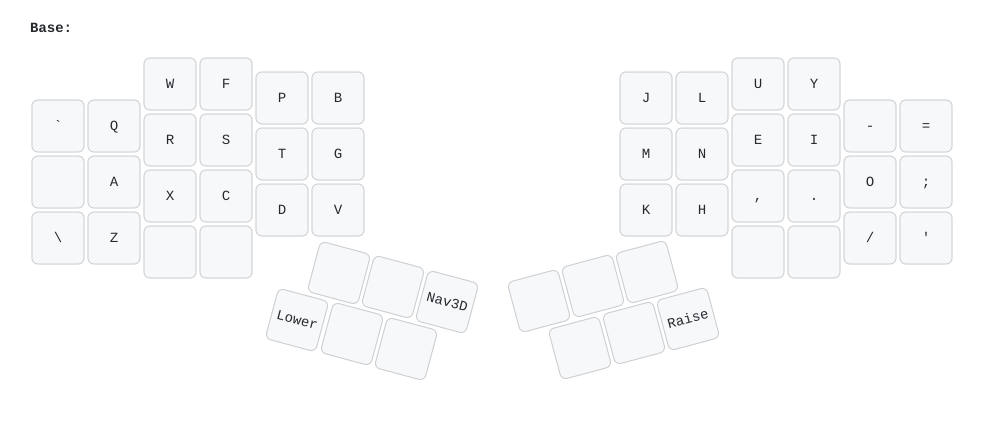
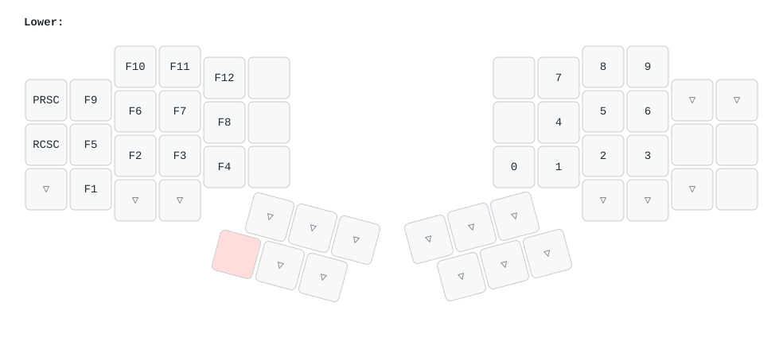
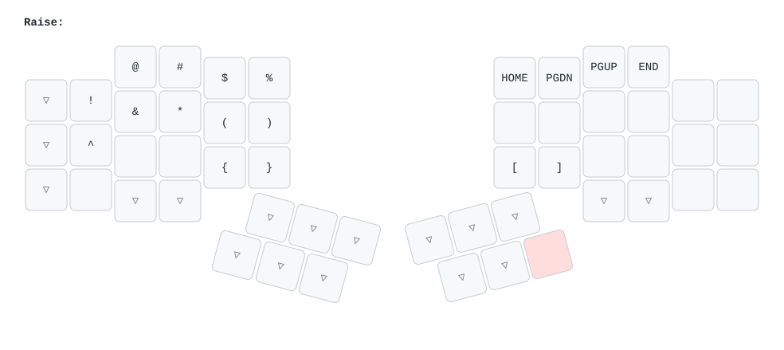
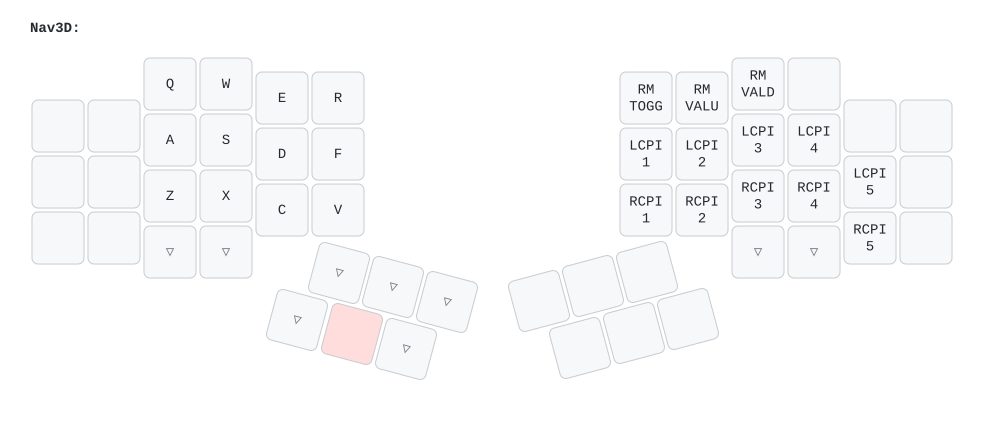

# QMK Imprint Layout

(for the same functionality on ZMK, see [here](https://github.com/jelmansouri/kyria-zmk))

Layout iteration is deceptively punishing: you only notice real flaws after you've practiced enough to be fast, and by then you've built muscle memory you might need to unlearn. The reason this is workable, beside the fun of learning is the ergo keyboard community being generous with their notes and over time you start building instincts for what will or won't work.

My layout primary goals
 * Make modifiers feel snappy and predictable without timing games.
 * Preserve all capabilities of a normal keyboard, and improving on many aspects (numpad layer, ...).
 * Reduce cognitive load of having to do more things to access capabilities (low number of layers, ...).
 * Provide good ergonomics and quality of life for my day to day usage (Coding, debugging, writing).
 * Optimize for MacOS
 
## Modifiers

Every modifier has its own dedicated key, with no tap-hold anywhere on the board, so there's no tapping term to tune and no timing to get right:
- **Ctrl and Option** sit on the two-key bottom row of each half, in the Mac order (Ctrl outside, Option inside).
- **Shift and Command** are on both thumb clusters.

Having every modifier on both halves means shortcuts can always be pressed with the opposite hand, and several modifiers can be combined without finger gymnastics.

The keymap's `config.h` only needs Caps Word and the one-shot layer settings (see below):

```c
#define CAPS_WORD_INVERT_ON_SHIFT
#define ONESHOT_TAP_TOGGLE 2
#define ONESHOT_TIMEOUT 500
```

## Layers:

The other big design decision was how many layers to live with. I prefer a low number of layers--constant layer switching only adds to the cognitive burden while typing. What mattered more was keeping navigation and the numpad anchored on the right half of the split. I'm used to moving lines in code editors by typing a relative line number followed by up or down, so I needed a flow where my left hand triggers the layer, the right hand types the number, and then I can immediately switch to Raise (sometimes while still holding Lower) and hit the direction keys. That interaction dictated the way I built the layers more than anything else.

All three layer keys (Lower, Raise and Nav3D) are **one-shot layers**:
- **Tap** once: the layer applies to the next key only, which is handy for a single symbol like a bracket.
- **Tap twice**: the layer locks (`ONESHOT_TAP_TOGGLE 2`). While locked, its layer key and, when showing, its keys pulse.
- **Hold**: works as a regular momentary layer, so the Lower -> Raise flow above still works.

A one-shot tap that isn't followed by a key within 500 ms (`ONESHOT_TIMEOUT`) is dropped.

Stock QMK only tracks one one-shot layer at a time, so combining layer keys could leave a layer stuck on, or a layer key held without its layer. The keymap handles the layer keys itself so that they combine predictably:
- **Holding two layer keys**: the last one pressed wins. Releasing it goes back to the other one, still held.
- **Tapping a layer key while holding another**: one-shot, then back to the held layer (e.g. hold Lower, tap Raise, press an arrow, keep typing numbers).
- **A locked layer acts like a layer key held forever**: other layer keys still work on top of it (tap for a one-shot, hold for a momentary layer) and it comes back once they are done. For example, with Raise locked, tapping Lower gives a single mouse click, then Raise again.
- **Tapping another layer key twice** moves the lock to it.
- **Pressing the locked layer key** unlocks it. Its layer stays active until the key is released, so a tap just returns to the base layer.



- **Layout**: Colemak-DH, with small punctuation tweaks.  
  - Underscore and colon moved to be more accessible to the pinky (frequently used in code).  

- **Bottom row**:  
  - Ctrl and Option on each half, mirrored so both hands can reach them.  

- **Thumb cluster**:  
  - Left: Esc, Enter and Nav3D on the upper arc; Lower, Shift and Command on the lower arc.  
  - Right: Caps Word, Space and Backspace on the upper arc; Command, Shift and Raise on the lower arc.  
  - Shift and Command on both sides let me trigger shortcuts with one hand while the other is on the mouse.  
  - Letters are plain keys, so **long-press vowels** on macOS (accented characters, essential for writing in French) work as usual.
 


- **Left side (function row)**:  
  - Arranged as 4 function keys per line.  
  - F9-F12 placed at the top for quick access (commonly used for debugging in Visual Studio).  
  - Screenshot shortcuts (Cmd-Shift-4 and Cmd-Shift-5) on the outer column.  
  - Mouse buttons (right, left and middle click) on the inner column.  

- **Right side (numpad)**:  
  - Standard numpad layout, with 0 next to the one, found that messing with thr order to privillege moat used used numbers not worth it.
  - Issue: `3` key overlaps with the dot on base, forcing an extra layer switch when ryping float, tryed added a dot on the thumb cluster beneath it but two dots keys became confusing, so reverted.  



- **Left side (symbols)**:  
  - Symbols arranged in the same order as a standard US keyboard.  
  - Curly braces sit below the parentheses.  

- **Right side (navigation + brackets)**:  
  - Arrow keys laid out in Vim order (H, J, K, L), with Home, Page Down, Page Up and End above them.  
  - Shifted one column to the right so they fall under stronger fingers.  
  - Square brackets sit below the left and down arrows, since they're often used together with modifiers.



Finally, I keep a dedicated layer for 3D navigation. My day-to-day work involves sometimes testing stuff i develop in 3D editors, and most of those tools cluster navigation shortcuts on the left side, assuming the right hand is busy on the mouse. I mirrored that expectation: this layer uses a conventional layout that matches the defaults in most software, so I never have to remap anything. Switching into it feels natural, and it keeps my muscle memory aligned across all the different 3D packages I touch.

The right half of this layer holds the settings: RGB toggle and brightness on the top row, left trackball (scroll) speed at 200-600 CPI on the home row, and right trackball (cursor) speed at 600-1600 CPI on the bottom row. Left and right click are on the right thumb cluster, next to Space, Backspace, Enter and Esc.

